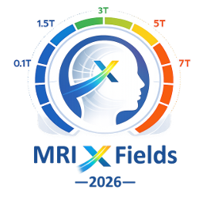
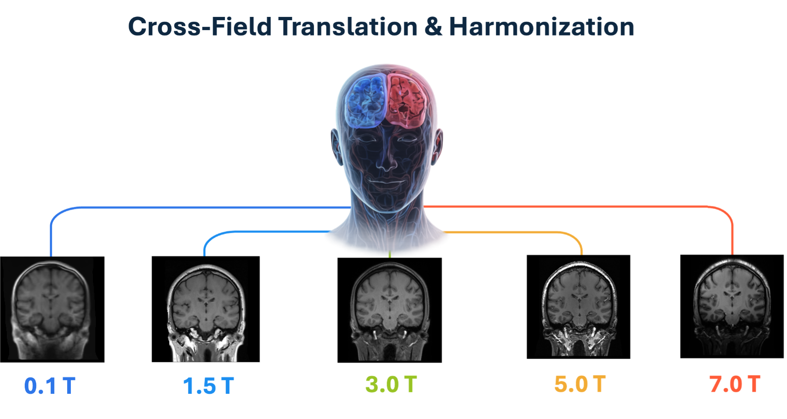
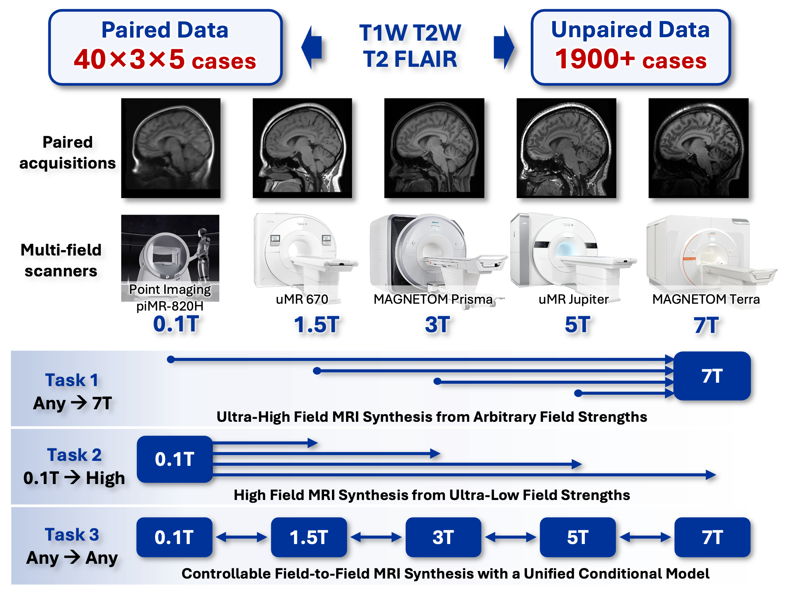

<p align="center">
  
</p>

<h1 align="center">MRIxFields2026</h1>

<p align="center">
  <b>A Benchmark for Cross-Field MRI Translation and Harmonization</b> | MICCAI 2026
</p>

<p align="center">
  <a href="https://mrixfields.chihucloud.com/2026/">Website</a> |
  <a href="https://www.synapse.org/Synapse:syn72060672/wiki/636549">Wiki</a> |
  <a href="https://www.synapse.org/Synapse:syn72060672/datasets/">Dataset</a> |
  <a href="https://github.com/MRIxFields/MRIxFields2026">GitHub</a>
</p>

## About

MRI systems operate at different magnetic field strengths (0.1T to 7T), each with distinct trade-offs between image quality, cost, and accessibility. Ultra-high-field (7T) MRI provides exceptional anatomical detail but remains limited to specialized centers. Ultra-low-field (0.1T) systems are portable and cost-effective but suffer from reduced signal-to-noise ratio. Meanwhile, the majority of clinical MRI studies use heterogeneous mid-range field strengths (1.5T-3T), creating systematic variability that challenges cross-center data integration.

**MRIxFields2026** provides a rigorous benchmark for assessing robustness, generalizability, and anatomical fidelity of generative models in multi-field MRI translation.

<p align="center">
  
</p>

---

## Participant Guide

> **Getting started?** Follow these 6 steps from data download to final submission.

| Step | What to Do | Where to Look |
|:----:|------------|---------------|
| 1 | **Understand the Tasks** — Learn what each task requires | [Below](#1-understand-the-tasks) |
| 2 | **Get the Data** — Download and explore the dataset | [Below](#2-get-the-data) |
| 3 | **Set Up Environment** — Install dependencies and configure paths | [Below](#3-set-up-environment) |
| 4 | **Develop Your Model** — Use our baselines or build your own | [Baseline/](Baseline/) |
| 5 | **Evaluate Your Results** — Run local evaluation | [Evaluation/](Evaluation/) |
| 6 | **Submit** — Upload your predictions | [Submission/](Submission/) |

---

### 1. Understand the Tasks

| Task | Goal | Input | Output |
|------|------|-------|--------|
| **Task 1** | Ultra-high field synthesis | 0.1T, 1.5T, 3T, or 5T | 7T |
| **Task 2** | Low-field enhancement | 0.1T | 1.5T, 3T, 5T, or 7T |
| **Task 3** | Unified any-to-any translation | Any field | Any field (single model) |

**Task 1: Ultra-High Field MRI Synthesis from Arbitrary Magnetic Field Strengths**

Generate 7T-equivalent brain MRI from arbitrary input field strengths. Models should recover fine anatomical details and quantitative properties associated with 7T imaging.

**Task 2: Higher-Field MRI Generation from Ultra-Low Magnetic Field Strengths**

Enhance 0.1T ultra-low-field MRI to restore clinically meaningful tissue contrast and structural information under severely degraded imaging conditions.

**Task 3: Controllable Field-to-Field MRI Synthesis with a Unified Conditional Model**

Perform any-to-any field translation using a single unified model with explicit conditioning on both source and target field strengths.

> **Model Requirements**:
> - **Task 1 & 2**: You may design separate models for different input field strengths and modalities (up to 12 models: 4 field strengths × 3 modalities).
> - **Task 3**: You must use a **single unified model** with one set of pretrained parameters. Submitting multiple models will result in disqualification.

Teams may participate in any or all tasks independently.

<p align="center">
  
</p>

---

### 2. Get the Data

#### Overview

| Property | Details |
|----------|---------|
| Field Strengths | 0.1T, 1.5T, 3T, 5T, 7T |
| Modalities | T1W, T2W, T2FLAIR |
| Anatomy | Whole brain |
| Format | NIfTI (.nii.gz), 364x436x364, MNI space |
| Training (unpaired) | `Training_retrospective` — different subjects per field strength |
| Training (paired) | `Training_prospective` — travelling volunteers scanned at all fields |
| Validation | `Validating_prospective` — paired travelling volunteers |
| Test | `Testing_prospective` — paired travelling volunteers |

Download from [Synapse](https://www.synapse.org/Synapse:syn72060672/datasets/).

#### MRI Scanners

| Field Strength | Scanner | Manufacturer |
|---------------|---------|-------------|
| 0.1T | piMR-820H | Point Imaging |
| 1.5T | uMR 670 | United Imaging Healthcare |
| 3T | MAGNETOM Prisma | Siemens Healthineers |
| 5T | uMR Jupiter | United Imaging Healthcare |
| 7T | MAGNETOM Terra | Siemens Healthineers |

#### Data Organization

```
$DATA_DIR/
├── Training_retrospective/          # Training (unpaired; different subjects per field)
│   ├── T1W/
│   │   ├── 0.1T/R_T1W_0.1T_0001.nii.gz ...   # IDs 0001-0100
│   │   ├── 1.5T/R_T1W_1.5T_0101.nii.gz ...   # IDs 0101-0321
│   │   ├── 3T/R_T1W_3T_0329.nii.gz   ...     # IDs 0329-0471
│   │   ├── 5T/R_T1W_5T_0515.nii.gz   ...     # IDs 0515-0637
│   │   └── 7T/R_T1W_7T_0822.nii.gz   ...     # IDs 0822-1056
│   ├── T2W/      {same structure}
│   └── T2FLAIR/  {same structure}
├── Training_prospective/            # Training (paired; same subject across all fields)
│   ├── T1W/
│   │   ├── 0.1T/P_T1W_0.1T_0006.nii.gz ...
│   │   ├── 1.5T/P_T1W_1.5T_0006.nii.gz ...
│   │   ├── 3T/P_T1W_3T_0006.nii.gz   ...
│   │   ├── 5T/P_T1W_5T_0006.nii.gz   ...
│   │   └── 7T/P_T1W_7T_0006.nii.gz   ...
│   ├── T2W/      {same structure}
│   └── T2FLAIR/  {same structure}
├── Validating_prospective/          # Validation (paired; IDs from 0001)
│   └── {same structure as Training_prospective}
└── Testing_prospective/             # Test (paired; IDs from 0021)
    └── {same structure as Training_prospective}
```

Filename convention: `{R|P}_{modality}_{field}_{subjID}.nii.gz`
- `R` = retrospective (unpaired; subject IDs do **not** overlap across fields)
- `P` = prospective (paired; the **same** subject ID appears at every field strength)
- `modality`: `T1W`, `T2W`, `T2FLAIR`
- `field`: `0.1T`, `1.5T`, `3T`, `5T`, `7T`
- `subjID`: zero-padded 4-digit ID (e.g. `0006`)

See [Tutorial/](Tutorial/) for data exploration notebooks.

---

### 3. Set Up Environment

#### Install Dependencies

```bash
# From repo root
conda env create -f environment.yml
conda activate mf
```

This installs PyTorch (CUDA 12.1), TensorFlow 2.15, and the `mrixfields` package.

For CUDA 11.8: edit `environment.yml` and replace `cu121` with `cu118` before running.

#### Configure Paths

```bash
cp .env.example .env
vim .env  # Edit paths below
```

| Variable | Description |
|----------|-------------|
| `DATA_DIR` | Dataset root (contains Training_retrospective, etc.) |
| `PREPROCESSED_DIR` | Extracted 2D slices for training |
| `OUTPUT_DIR` | Training checkpoints |
| `INFERENCE_DIR` | Inference outputs |
| `SYNTHSEG_DIR` | SynthSeg installation (for evaluation) |
| `DEVICE` | GPU device (e.g. `cuda:0`) |

#### SynthSeg (for Dice/Volume metrics)

```bash
git clone https://github.com/BBillot/SynthSeg.git /path/to/SynthSeg
```

Download model files — see [Evaluation/README.md](Evaluation/README.md) for details.

---

### 4. Develop Your Model

You can start with our baseline models (CUT, CycleGAN, StarGAN v2) or develop your own approach.

See [Baseline/](Baseline/) for:
- Preprocessing, training, and inference scripts
- Pre-trained model weights
- Training configurations for all tasks

See [Tutorial/](Tutorial/) for step-by-step Jupyter notebooks.

---

### 5. Evaluate Your Results

All three tasks are evaluated using five complementary metrics:

| Metric | Description | Direction |
|--------|-------------|-----------|
| **nRMSE** | Normalized Root Mean Square Error | Lower is better |
| **SSIM** | Structural Similarity Index | Higher is better |
| **LPIPS** | Learned Perceptual Image Patch Similarity | Lower is better |
| **Dice** | Overlap on 14 deep gray matter structures (via SynthSeg) | Higher is better |
| **Volume** | Normalized volume consistency per structure | Higher is better |

**Ranking**: Sum of per-metric ranks across all 5 metrics. Lowest total wins.

Top-ranked submissions undergo blinded visual inspection by experienced neuroradiologists.

See [Evaluation/](Evaluation/) for local evaluation scripts and SynthSeg setup.

---

### 6. Submit

Submit your predictions as a zip file via [Synapse](https://www.synapse.org/Synapse:syn72060672).

See [Submission/](Submission/) for:
- Directory structure and file naming rules
- Output format requirements

---

## Repository Structure

```
MRIxFields2026/
├── Baseline/                        # Baseline models and training code
│   ├── mrixfields/                  #   Python package (models, losses, data)
│   ├── configs/                     #   51 task configs (task1/task2/task3)
│   ├── scripts/                     #   train.py, inference.py, preprocess.py
│   └── README.md                    #   Installation and usage guide
├── Tutorial/                        # Jupyter notebooks
│   ├── 01_data_exploration.ipynb
│   ├── 02_baseline.ipynb
│   └── 03_evaluation.ipynb
├── Evaluation/                      # Evaluation scripts
│   ├── segment.py                   #   SynthSeg segmentation
│   ├── evaluate.py                  #   Compute all 5 metrics
│   └── README.md                    #   Evaluation guide + SynthSeg setup
├── Submission/                      # Submission guidelines
│   └── README.md                    #   Format specification
├── assets/                          # Figures for README
├── environment.yml                  # Conda environment
├── .env.example                     # Path configuration template
└── README.md                        # This file
```

## Timeline

| Date | Event |
|------|-------|
| Apr 01, 2026 | Registration opens |
| Apr 10, 2026 | Training data released |
| Apr 20, 2026 | Validation data released |
| May 10, 2026 | Validation submission opens |
| Jul 01, 2026 | Testing submission opens |
| Sept 10, 2026 | Submission deadline |
| Oct 08, 2026 | Results at MICCAI |

All deadlines are 11:59 PM PST.

## Contact

- GitHub Issues: [MRIxFields/MRIxFields2026](https://github.com/MRIxFields/MRIxFields2026/issues)
- Email: **mrixfields@outlook.com**

## License

- Code: MIT License ([LICENSE](LICENSE))

## Publication

Challenge papers will be published in LNCS proceedings. See the [challenge website](https://mrixfields.chihucloud.com/2026/) for workshop paper submission details.

## References

1. Dai, Y. et al. *Leveraging Deep Learning to Enhance MRI for Brain Disorders.* 2025.02.10.25321126 (2025).
2. Dai, Y., Wang, C. & Wang, H. *Deep compressed sensing MRI via a gradient-enhanced fusion model.* Med Phys 50, 1390–1405 (2023).
3. Wang, F. et al. *Multiple B-Value Model-Based Residual Network (MORN) for Accelerated High-Resolution Diffusion-Weighted Imaging.* IEEE J Biomed Health Inform 26, 4575–4586 (2022).
4. Wang, C. et al. *Protocol for Brain Magnetic Resonance Imaging and Extraction of Imaging-Derived Phenotypes from the China Phenobank Project.* Phenomics 3, 642–656 (2023).
5. Tang, W. et al. *Aleatoric-Uncertainty-Aware Maximum Intensity Projection-Based GAN for 7T-Like Generation From 3T TOF-MRA.* IEEE Journal of Biomedical and Health Informatics 29, 6664–6677 (2025).
6. Bahrami, K., Rekik, I., Shi, F. & Shen, D. *Joint Reconstruction and Segmentation of 7T-like MR Images from 3T MRI Based on Cascaded Convolutional Neural Networks.* Med Image Comput Comput Assist Interv 10433, 764–772 (2017).
7. Billot, B. et al. *SynthSeg: Segmentation of brain MRI scans of any contrast and resolution without retraining.* Medical Image Analysis 86, 102789 (2023).
8. Cosottini, M. et al. *Comparison of 3T and 7T susceptibility-weighted angiography of the substantia nigra in diagnosing Parkinson disease.* AJNR Am J Neuroradiol 36, 461–466 (2015).
9. Duan, C. et al. *Synthesized 7T MPRAGE From 3T MPRAGE Using Generative Adversarial Network and Validation in Clinical Brain Imaging: A Feasibility Study.* J Magn Reson Imaging 59, 1620–1629 (2024).
10. Eidex, Z. et al. *High-resolution 3T to 7T ADC map synthesis with a hybrid CNN-transformer model.* Med Phys 51, 4380–4388 (2024).
11. Li, S. et al. *Synthetizing SWI from 3T to 7T by generative diffusion network for deep medullary veins visualization.* Neuroimage 320, 121475 (2025).
12. Lv, J. et al. *Transfer learning enhanced generative adversarial networks for multi-channel MRI reconstruction.* Comput Biol Med 134, 104504 (2021).
13. Maranzano, J. et al. *Comparison of Multiple Sclerosis Cortical Lesion Types Detected by Multicontrast 3T and 7T MRI.* AJNR Am J Neuroradiol 40, 1162–1169 (2019).
14. Obusez, E. C. et al. *7T MR of intracranial pathology: Preliminary observations and comparisons to 3T and 1.5T.* Neuroimage 168, 459–476 (2018).
15. Qu, L., Zhang, Y., Wang, S., Yap, P.-T. & Shen, D. *Synthesized 7T MRI from 3T MRI via deep learning in spatial and wavelet domains.* Med Image Anal 62, 101663 (2020).
16. Sun, Y., Wang, L., Li, G., Lin, W. & Wang, L. *A foundation model for enhancing magnetic resonance images and downstream segmentation, registration and diagnostic tasks.* Nat Biomed Eng 9, 521–538 (2025).

## Acknowledgments

**Organizing Team**:

<p align="center">
  
</p>

- Chengyan Wang (Co-Event Leader), Liguo Jia, Chen Zhu, Xiaoqing Qiao — Human Phenome Institute, Fudan University, China
- Hao Li (Co-Event Leader), He Wang, Weirui Cai, Hui Zhang, Xueqin Xia, Xin Guo, Chang Xu — Institute of Science and Technology for Brain-inspired Intelligence, Fudan University, China
- Yucheng Yang, Tianxing He — College of Biomedical Engineering, Fudan University, China
- Dinggang Shen, Kaicong Sun — School of Biomedical Engineering, ShanghaiTech University, China
- Jiahao Huang (Platform Manager), Guang Yang — Department of Bioengineering and I-X, Imperial College London, UK
- Yuxiang Dai (Data Preprocessing and Evaluation Manager/QC) — Department of Psychiatry and Neuroscience, Charité – Universitätsmedizin Berlin, Germany
- Zhiyong Zhang, Cheng Jin, Hao Chen, Yueqi Qiu — School of Biomedical Engineering, Shanghai Jiao Tong University, China
- Andrew Webb — Leiden University, Netherlands
- Zhang Shi — Department of Radiology, Zhongshan Hospital, Fudan University, China
- Juergen Hennig — University Medical Center Freiburg, Germany
- Fangrong Zong, Yong Liu — School of Artificial Intelligence, Beijing University of Posts and Telecommunications, China
- Xingfeng Shao — Institute for Medical Imaging Technology, Ruijin Hospital, Shanghai Jiao Tong University School of Medicine, China
- Zixuan Lin — College of Biomedical Engineering & Instrument Science, Zhejiang University, China
- Jun Lyu, Xiaodong Zhong — Department of Radiological Sciences, University of California, Los Angeles, USA
- Chengcheng Zhu — University of Washington, USA
- Buyun Liu — University of Science and Technology of China, China
- Daguang Xu, Can Zhao — NVIDIA Corporation

**Sponsor**: [Shanghai Point Imaging Healthcare Co., Ltd.](https://point-imaging.com/)

**Ethics**: Approved by the Ethics Committee of Zhongshan Hospital, Fudan University

**Data Collection**: Fudan University Brain Imaging Center, Point Imaging Shanghai, Sheshan Campus Zhongshan Hospital

**Platform**: [Synapse](https://www.synapse.org/Synapse:syn72060672)
