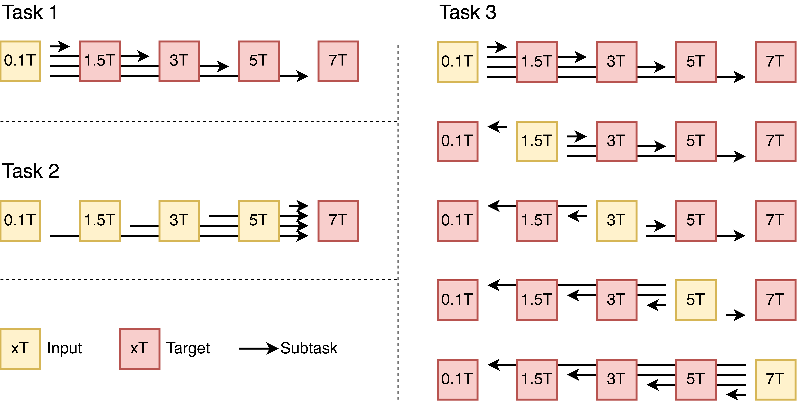

# Submission Guidelines

> **Note**: This document is subject to change. Please check back for updates.

## Validation Phase

### Pipeline overview

End-to-end you go through 5 steps. Steps 1–2 live in `Baseline/`; Steps 3–5
are what this folder is about. If you've already finished inference +
segmentation following the `Baseline/` tutorial, jump to Step 3.

| # | Stage | Tool | Reads | Writes |
|---|---|---|---|---|
| 1 | Inference | `Baseline/scripts/inference.py` | `$DATA_DIR` | `$INFERENCE_DIR/{task}_{pair}_{MOD}/{method}/{mode}/{epoch}/` (source-field-tagged) |
| 2 | Segment predictions *(Task 1/2 only)* | `Baseline/scripts/segment_predictions.py` | `$INFERENCE_DIR` + `$SYNTHSEG_DIR` | `$PREDICTIONS_SEG_DIR/...` (mirrors Step 1's sweep tree; NN-resampled to 0.5 mm) |
| 3 | Build submission tree | `Submission/build_submission/build_submission.py` ([README](build_submission/README.md)) | `$INFERENCE_DIR` + `$PREDICTIONS_SEG_DIR` | `$SUBMISSION_DIR/{task1,task2,task3}/{mod}/{pair}/{pred,seg}/` (target-field-tagged, axially sliced to `(364, 436, 30)`) |
| 4 | Zip per task | `cd $SUBMISSION_DIR/taskN && zip -r ~/taskN.zip T1W T2W T2FLAIR` | `$SUBMISSION_DIR/taskN/` | `~/task{1,2,3}.zip` |
| 5 | Upload | [Synapse syn72060672](https://www.synapse.org/Synapse:syn72060672) | `~/task{1,2,3}.zip` | leaderboard score |

Paths come from `.env`: `INFERENCE_DIR`, `PREDICTIONS_SEG_DIR`,
`SUBMISSION_DIR`, `SYNTHSEG_DIR`. Step 3 reads all three; Step 4 only needs
`SUBMISSION_DIR`.

**Which README do I read?**
- This file — submission rules, file format, layout, IDs. **Start here.**
- [build_submission/README.md](build_submission/README.md) — Step 3 tool reference (flags, sweep selection, axial z-clip default).
- [evaluation-2026/README.md](evaluation-2026/README.md) — local self-check scorer (and internal-staff operations).

### Tasks

The challenge has three independent tasks. Each task is a set of directed
`source field → target field` translations across 3 modalities (T1W / T2W /
T2FLAIR). Submit **one zip per task** to the platform. The figure below maps
out every subtask — yellow boxes are the inputs you receive, red boxes are
the targets you generate, and each arrow is one subtask.

<div align="center">
  
</div>

Submit via the [Synapse platform](https://www.synapse.org/Synapse:syn72060672):

| Zip filename | Task | Pairs | seg/ |
|--------------|------|-------|------|
| `task1.zip` | Any → 7T | 4 (`0.1T_to_7T`, `1.5T_to_7T`, `3T_to_7T`, `5T_to_7T`) | **mandatory** |
| `task2.zip` | 0.1T → Higher | 4 (`0.1T_to_1.5T`, `0.1T_to_3T`, `0.1T_to_5T`, `0.1T_to_7T`) | **mandatory** |
| `task3.zip` | Any → Any (unified model) | 20 directed pairs (5 src × 4 tgt, incl. downfield) | not used |

Bundle one task per zip — each task is a separate Synapse upload. If you
don't participate in a given task, just skip its zip.

### Subject IDs (validation phase)

The validation cohort is paired multi-field: every patient has scans at **all 5 field strengths × 3 modalities** in our private ground truth. The public input release exposes only **3 patient IDs per source field**, with disjoint ID sets per source field — every patient is given to participants in **exactly one** source field, and the same patient's other-field scans are held out as paired GT for evaluation.

| Source field | Released input IDs |
|---|---|
| `0.1T` | `0001`, `0002`, `0003` |
| `1.5T` | `0004`, `0005`, `0008` |
| `3T`   | `0010`, `0011`, `0012` |
| `5T`   | `0013`, `0014`, `0015` |
| `7T`   | `0016`, `0017`, `0018` |

Naming rule: keep the source ID and replace the field tag with the target field. For example, given source input `P_T1W_0.1T_0001.nii.gz`, the `0.1T_to_7T` prediction is `P_T1W_7T_0001.nii.gz`. The evaluator looks up patient `0001` in the private 7T GT for the comparison.

Expected file IDs per `(modality, pair)` follow the source field of that pair:

#### Task 1 — `Any → 7T` (12 subtasks; `pred/` + `seg/`)
| pair | IDs |
|---|---|
| `0.1T_to_7T` | `0001`, `0002`, `0003` |
| `1.5T_to_7T` | `0004`, `0005`, `0008` |
| `3T_to_7T`   | `0010`, `0011`, `0012` |
| `5T_to_7T`   | `0013`, `0014`, `0015` |

#### Task 2 — `0.1T → Higher` (12 subtasks; `pred/` + `seg/`)
All four pairs use the 0.1T set: **`0001`, `0002`, `0003`**.

#### Task 3 — `Any → Any` (60 subtasks; `pred/` only)
| Source field of pair | IDs |
|---|---|
| `0.1T_to_*` | `0001`, `0002`, `0003` |
| `1.5T_to_*` | `0004`, `0005`, `0008` |
| `3T_to_*`   | `0010`, `0011`, `0012` |
| `5T_to_*`   | `0013`, `0014`, `0015` |
| `7T_to_*`   | `0016`, `0017`, `0018` |

### Directory structure (inside each zip)

The zip filename already encodes the task, so each zip's internal layout starts at the modality level — no `task{N}/` prefix. This mirrors the dataset's `{modality}/{field}/<file>.nii.gz` ordering one-to-one (the submission's `pair` plays the role of the dataset's `field`). Filenames are identical to the corresponding GT file.

```
task1.zip                                     # Task 1: Any -> 7T  (4 pairs × 3 modalities × 3 subjects)
└── (zip root)
    ├── T1W/
    │   ├── 0.1T_to_7T/                       # IDs 0001, 0002, 0003
    │   │   ├── pred/
    │   │   │   ├── P_T1W_7T_0001.nii.gz
    │   │   │   ├── P_T1W_7T_0002.nii.gz
    │   │   │   └── P_T1W_7T_0003.nii.gz
    │   │   └── seg/                          # mandatory for task1 — drives Dice / Volume
    │   │       ├── P_T1W_7T_0001_seg.nii.gz
    │   │       ├── P_T1W_7T_0002_seg.nii.gz
    │   │       └── P_T1W_7T_0003_seg.nii.gz
    │   ├── 1.5T_to_7T/                       # IDs 0004, 0005, 0008  (same pred/ + seg/ shape)
    │   ├── 3T_to_7T/                         # IDs 0010, 0011, 0012
    │   └── 5T_to_7T/                         # IDs 0013, 0014, 0015
    ├── T2W/                                  # same 4 pairs × {pred, seg} shape as T1W
    └── T2FLAIR/

task2.zip                                     # Task 2: 0.1T -> Higher  (4 pairs × 3 modalities × 3 subjects)
└── (zip root)
    ├── T1W/
    │   ├── 0.1T_to_1.5T/                     # all task2 pairs use IDs 0001, 0002, 0003
    │   ├── 0.1T_to_3T/
    │   ├── 0.1T_to_5T/
    │   └── 0.1T_to_7T/                       # each: pred/ (3 files) + seg/ (3 files)
    ├── T2W/
    └── T2FLAIR/

task3.zip                                     # Task 3: Any -> Any  (20 pairs × 3 modalities × 3 subjects, pred/ only)
└── (zip root)
    ├── T1W/                                  # 5 source fields × 4 target fields = 20 directed pairs (incl. downfield)
    │   ├── 0.1T_to_1.5T/
    │   │   └── pred/                         # task3 carries no seg/
    │   │       ├── P_T1W_1.5T_0001.nii.gz    # IDs from source field (0.1T → 0001/0002/0003)
    │   │       ├── P_T1W_1.5T_0002.nii.gz
    │   │       └── P_T1W_1.5T_0003.nii.gz
    │   ├── 0.1T_to_3T/                       # IDs 0001, 0002, 0003
    │   ├── 0.1T_to_5T/
    │   ├── 0.1T_to_7T/
    │   ├── 1.5T_to_0.1T/                     # IDs 0004, 0005, 0008
    │   ├── 1.5T_to_3T/
    │   ├── 1.5T_to_5T/
    │   ├── 1.5T_to_7T/
    │   ├── 3T_to_0.1T/                       # IDs 0010, 0011, 0012
    │   ├── 3T_to_1.5T/
    │   ├── 3T_to_5T/
    │   ├── 3T_to_7T/
    │   ├── 5T_to_0.1T/                       # IDs 0013, 0014, 0015
    │   ├── 5T_to_1.5T/
    │   ├── 5T_to_3T/
    │   ├── 5T_to_7T/
    │   ├── 7T_to_0.1T/                       # IDs 0016, 0017, 0018
    │   ├── 7T_to_1.5T/
    │   ├── 7T_to_3T/
    │   └── 7T_to_5T/
    ├── T2W/
    └── T2FLAIR/
```

Per-task contents (validation phase: 3 input subjects per `(modality, source field)`):

- **Task 1** — `Any → 7T`: 4 pairs × 3 modalities = **12** `(modality, pair)` directories. Each contains `pred/` + `seg/` (both mandatory).
- **Task 2** — `0.1T → Higher`: 4 pairs × 3 modalities = **12** directories, each with `pred/` + `seg/` (both mandatory).
- **Task 3** — `Any → Any` (single unified model): 20 directed pairs (incl. downfield, e.g. `7T_to_0.1T`) × 3 modalities = **60** directories. Each contains `pred/` only — Task 3 is scored on voxel-level metrics (nRMSE / SSIM / LPIPS). Any `seg/` placed inside `task3.zip` is ignored.

### File format & naming

Predictions are NIfTI (`.nii.gz`), float32, shape `(364, 436, 30)`, intensity in `[0, 1]`. The shape is the axial slab `[150, 180)` of the original `(364, 436, 364)` dataset grid; [build_submission](build_submission/) produces this from your full-volume inference output automatically.

Segmentations (task1/task2) are NIfTI (`.nii.gz`), integer labels, shape `(364, 436, 30)` — same axial slab as the prediction, on the same 0.5 mm grid. [Baseline/scripts/segment_predictions.py](../Baseline/scripts/segment_predictions.py) runs SynthSeg and resamples the result to 0.5 mm to match; [build_submission](build_submission/) then slices both pred and seg with the same z range, so they share an affine and the evaluator's shape check passes.

Filenames must match the corresponding ground-truth file:

| Type | Pattern | Example |
|------|---------|---------|
| Prediction | `P_{MOD}_{TARGET_FIELD}_{ID:04d}.nii.gz` | `P_T1W_7T_0001.nii.gz` |
| Segmentation (Task 1/2 only) | `P_{MOD}_{TARGET_FIELD}_{ID:04d}_seg.nii.gz` | `P_T1W_7T_0001_seg.nii.gz` |

- `MOD` ∈ {T1W, T2W, T2FLAIR}
- `TARGET_FIELD` is the **target** field of the pair (e.g. `7T` for `0.1T_to_7T`), not the input
- `ID` is the 4-digit zero-padded subject ID — copy it verbatim from the source input filename

Worked example (for pair `0.1T_to_7T`, subject `0001`):

```
Inference input:    P_T1W_0.1T_0001.nii.gz   (source field 0.1T, ID 0001)
Submission file:    P_T1W_7T_0001.nii.gz     (target field 7T, ID preserved)
                          ^^                  ↑ only the field tag changes;
                                                MOD and ID are copied verbatim
```

### Building the zips (Steps 3–4)

Two steps: (3) populate the per-task tree from your inference outputs, (4) zip each task subtree.

**Step 3 — Populate the tree.** [build_submission](build_submission/) reads `$INFERENCE_DIR` and `$PREDICTIONS_SEG_DIR`, copies into the right layout, renames source field tags to target field tags, and axially slices both pred and seg to `(364, 436, 30)`:

```bash
python Submission/build_submission/build_submission.py
```

See [build_submission/README](build_submission/README.md) for options (single task, dry-run, custom paths, sweep overrides).

**Step 4 — Zip each task subtree.** `cd` into the task directory so the zip's internal root starts at the modality level (no `task{N}/` prefix):

```bash
cd $SUBMISSION_DIR/task1 && zip -r ~/task1.zip T1W T2W T2FLAIR
cd $SUBMISSION_DIR/task2 && zip -r ~/task2.zip T1W T2W T2FLAIR
cd $SUBMISSION_DIR/task3 && zip -r ~/task3.zip T1W T2W T2FLAIR
```

**Manual layout fallback.** If you don't use `build_submission`, this repo ships [submission_template/](submission_template/) as a starter template — three subtrees with empty 0-byte `.nii.gz` placeholders so you can see the exact filenames the scorer expects. Replace each placeholder with your prediction (same shape `(364, 436, 30)`, same z range `[150, 180)` on the 0.5 mm grid) and zip from `Submission/submission_template/task{N}/` instead. The directory name `submission_template/` is a working folder only — it does not appear inside any uploaded zip.

### Notes

**Axial slice range.** [build_submission](build_submission/) and the GT pack both slice along axial `[150, 180)` (a shared `Z_CLIP_RANGE` constant — see [Baseline/mrixfields/zclip_constants.py](../Baseline/mrixfields/zclip_constants.py)). Pred and GT share the same affine origin so voxel-wise metrics align. The slab covers physical z ≈ +3.0 mm to +17.5 mm in MNI space (30 slices × 0.5 mm). If you want to submit a different z range, override `Z_CLIP_RANGE` — but the GT is fixed at `[150, 180)`, so anything else will fail the evaluator's shape check.

**Omitting `seg/` (Task 1/2).** For Task 1/2 submissions that contain *zero* `_seg.nii.gz` files, Dice / Volume are reported as `null` and the submission still scores SSIM / nRMSE / LPIPS normally. As soon as the submission contains *any* seg file, seg is treated as required and every `(modality, pair)` must have a seg file for every subject the GT lists. See [evaluation-2026/README.md "Missing-submission handling"](evaluation-2026/README.md#missing-submission-handling) for the exact rule.

**Partial submissions.** Predictions can be omitted per modality / pair / subject; missing predictions are filled with worst-case metric values rather than skipped. See [evaluation-2026/README.md "Missing-submission handling"](evaluation-2026/README.md#missing-submission-handling).

**Optional self-check.** Run [Submission/evaluation-2026/score.py](evaluation-2026/score.py) against the extracted task directory (not the zip) before upload. See [evaluation-2026/README.md](evaluation-2026/README.md) for usage.


## Testing Phase (To be updated)

*Docker container submission details will be provided here.*

## Contact

For submission issues: **mrixfields@outlook.com**
